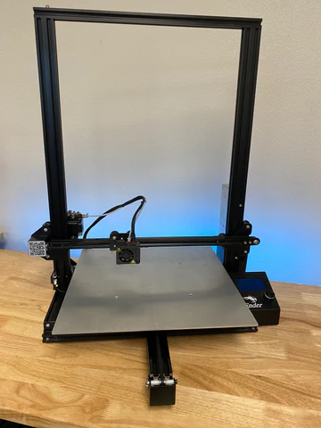

# Creality Ender-3 Pro XL 3D Printer
 
 

Ender-3 Pro XL is a Fused Deposition Modelling machine FDM. The system has been customized to allow greater freedom of operation. 

Upgrades to machine 

* Increased gantry size : 400mmX, 400mm Y, 500mm Z  
* Duet 2 Wifi controller : Greater Control    
* BL touch sensor: Self Levelling Functionality  
* 1000W heater bed: Allows for Greater Material Choices   

More updates coming soon! 

