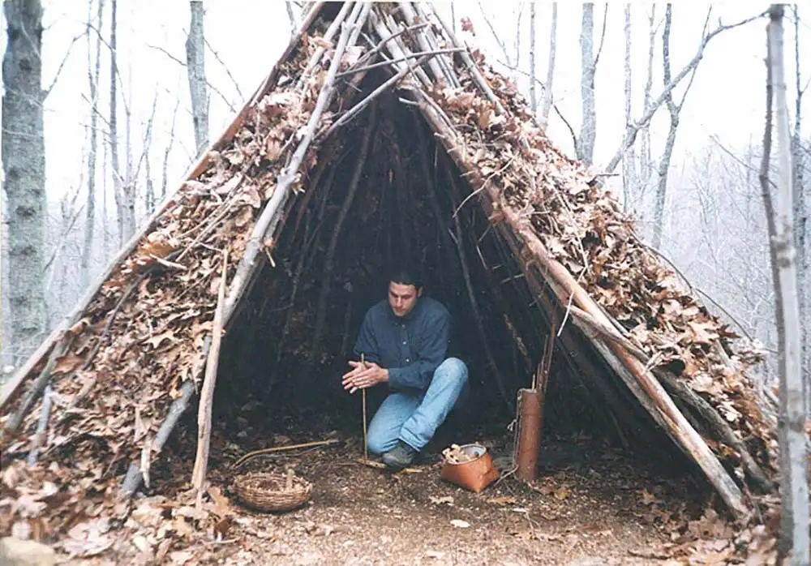

# Mechanical Tools

How would you build a shelter without modern tools?   

{width=80%} 
 

* What are some of the things you would do and limitations that you would have? 
 

| Things I would do|  Limitations I would have   | 
|----------|:-------------:|
| Gather long sticks or logs | They would not fit together nicely |
| Collect moss and mud|  Restricted to what I could find   | 
|...|...|

* What are the basics you would need to know to build modern tools?  
 

| Things I would need to know|  Limitations I would have   | 
|----------|:-------------:|
| How do I  make metal | What ore is around where I live |
| How would I generate enough heat|  What materials are around and how hot do they burn  | 
|...|...|

