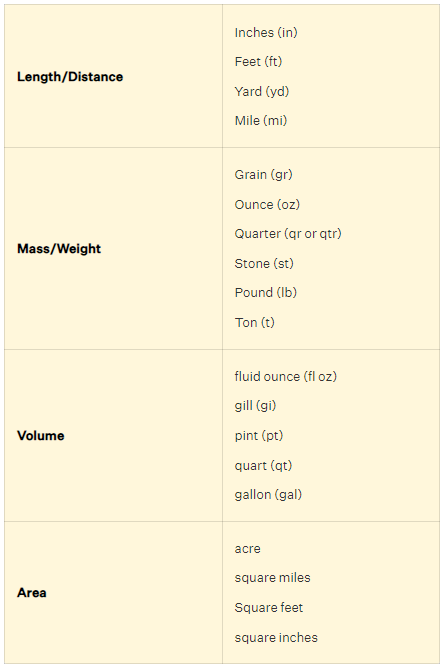

# UNITS OF MEASURE

How would you determine the distance to the sun? 
How did the first person determine the distance to the sun?  
How accurate were they? 

## Standard International Units SI

** How did society decide what are standard units?** 

A meter is defined as the path length that light travels through a vacuum in 1/299,792,458 of a second 

Deeper Inquiry Link: 
[Definition of meter](https://www.nist.gov/si-redefinition/meter){:target="_blank"}

A Kilogram is most often referred to by the mass of 1000 cm^3 of water at Standard temperature and pressure or STP

Deeper Inquiry Link: 
[Systems of Standards](https://www.nist.gov/si-redefinition/turning-point-humanity-redefining-worlds-measurement-system){:target="_blank"}

**Metric Units**
  
Source:https://www.cuemath.com/measurement/metric-system/

## Imperial Units

There are parts of the world that use different units of measurement and the United States is one of them.  
Depending on what you decide to do as you grow up, different systems will have to be understood. Even in Canada it is most common for the construction industry to use Imperial units. Enginnering plans may be in metric, but have to be converted to Imperial onsite during buiilding.  

Can you think why this might be the case? 

  
Source: https://www.cuemath.com/measurement/imperial-system/

Deeper Inquiry Link: 
[Imperial Units](https://www.britannica.com/science/inch){:target="_blank"}

