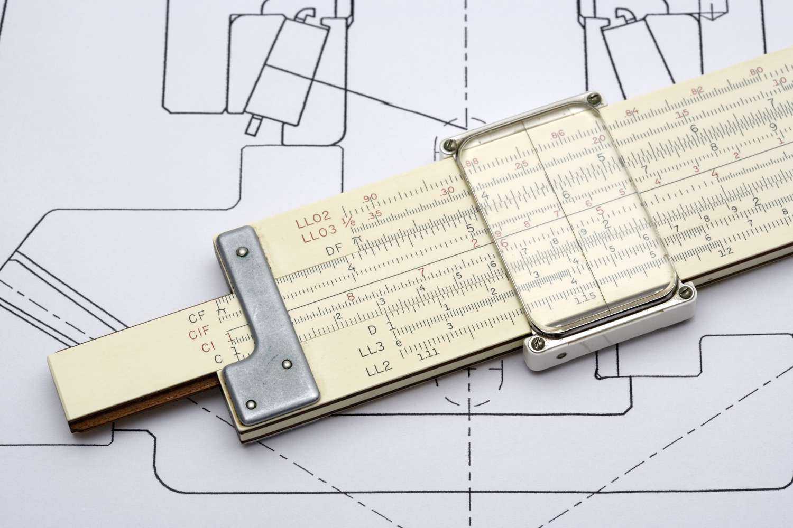
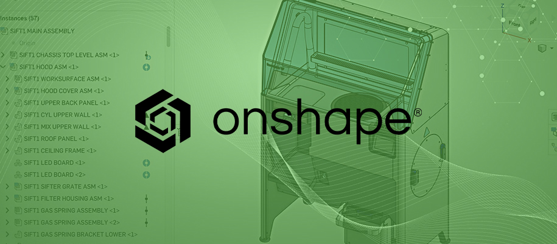
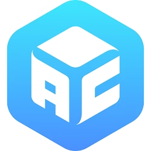

# Software

In todays ever changing world software is becoming ubiquitous. The beauty of software is that it can be changed relatively easy once you have the knowledge and expertise. 

**Do you know what a slide rule is?**  
{width=70%}
  
Deeper Inquiry Link: 
[Slide Rule](https://www.britannica.com/science/slide-rule){:target="_blank"} 

**How about the Sumarian Abacus?**  
  
Deeper Inquiry Link: 
[Sumarian Abacus](https://medium.com/tech-is-a-tool/the-dawn-of-computing-sumerian-abacus-83bdefb697ba){:target="_blank"} 

Understanding where technologies came from and how the technology evolved allows us to made improvements on what is currently state-of-the-art.

**What people can accomplish in an hour today using modern software, was unfathomable only 80 years ago**

## Onshape CAD

 
 

Onshape is a professional Computer Aided Design [CAD] Software. The Onshape CAD system allows multiple users to access and work on a single design concurrently over the cloud, using any computer, tablet or phone. Onshape allows teams to collaborate on a single shared design, the same way multiple writers can work together editing a shared document via cloud services.

**Professional-grade CAD** 

* Efficient workflows to design parts, assemblies, drawings, sheet metal, frames etc. 
* Real-time collaboration across your design team 
* Built-in PDM: Modern approaches to version control and release management 
* Simulation 
* Rendering 
* ECAD/MCAD 

## Cura Slicer

 
 
There are a wide range of slicer software available these days and although some allow for greater control over the support structure and different scaffolding patterns. Cura Slicer is easy to use and is free, allowing students to download and engage with the software at home. 

## Anycubic Photon Workshop

 

There are a wide range of slicer software available these days and although some allow for greater control over the support structure and different scaffolding patterns. Anycubic Photon Workshop is easy to use and is free, allowing students to download and engage with the software at home. 
