# Cura Slicer

### STL to G-code

 
 

Your design and CAD is done now its time to get ready to set up the 3D printer file. 

### Working from home

Always ensure you have permission to install software on devices before installing  
if you are working from home download the Cura Software by clicking the link below 

[UltiMaker Cura Slicer](https://ultimaker.com/software/ultimaker-cura/){:target="_blank"}

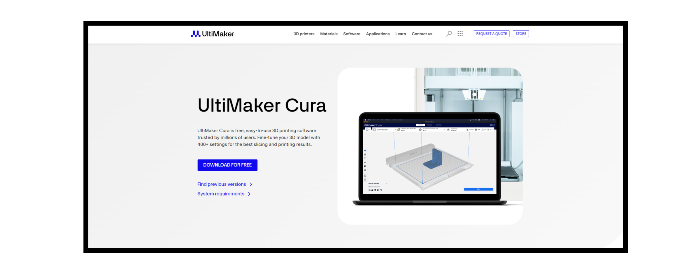 
1) Click download for free  

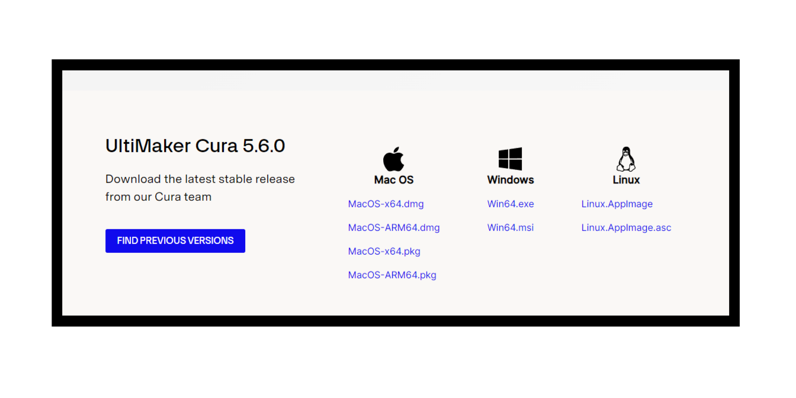  
2) Choose the right version of the software for the system you are working on (ie. windoes x64)  

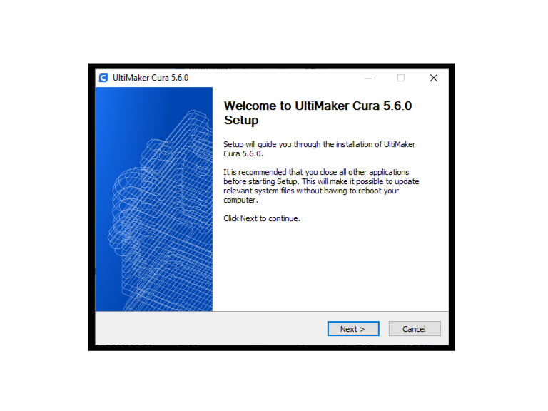  
3) Click next to begin install   

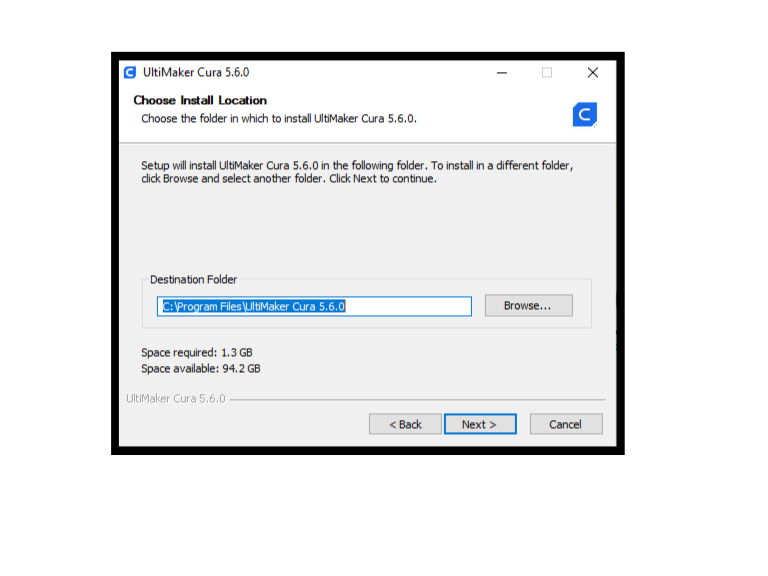  
4) Click next to accept default location destination for file install (default recommended)  

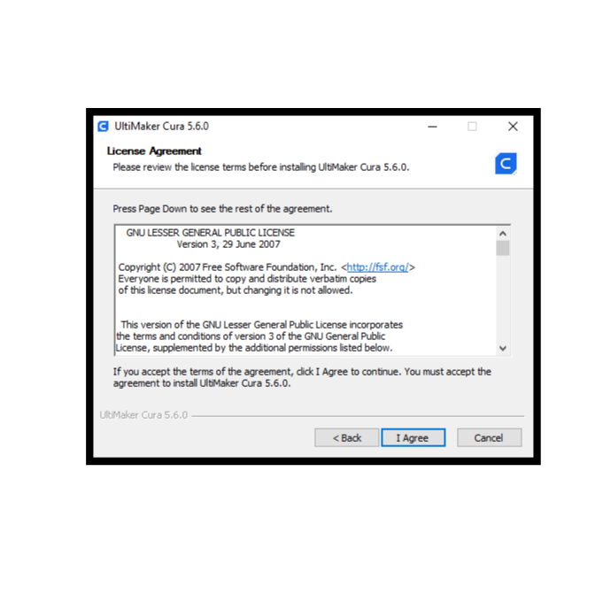  
5) Read agreement and select " I Agree" to install  

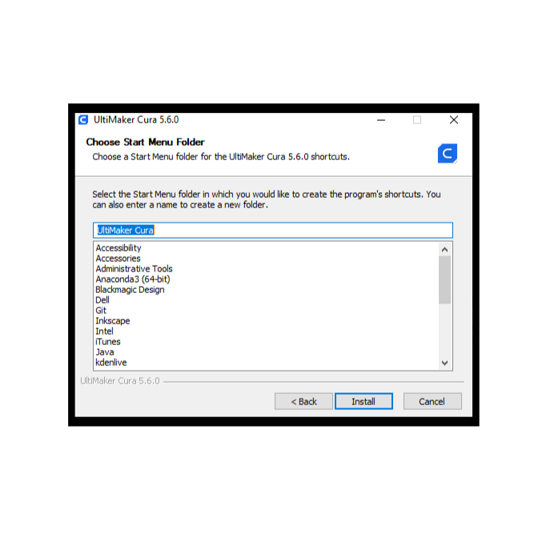  
6) Choose start menu folder select "Install" to begin install(default recommended)  

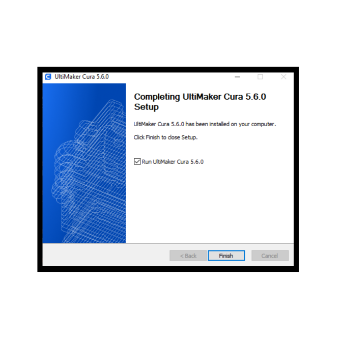  
7) select "Finish" to complete install  

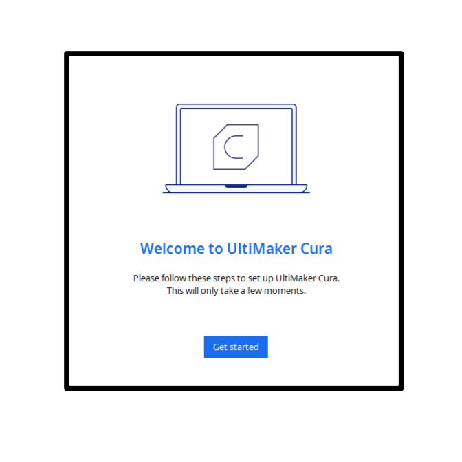  
8) select "Get Started" to begin  

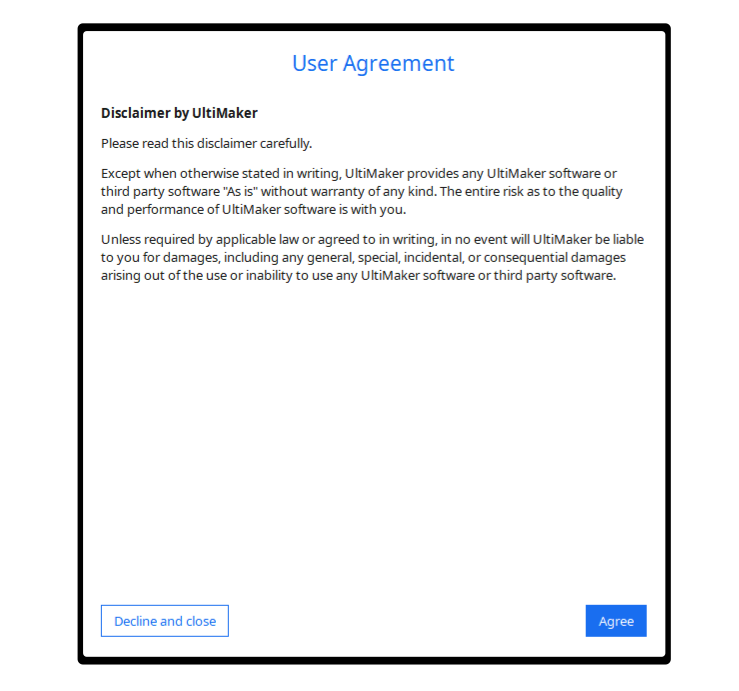  
9) Click "Agree" to accept user agreement   

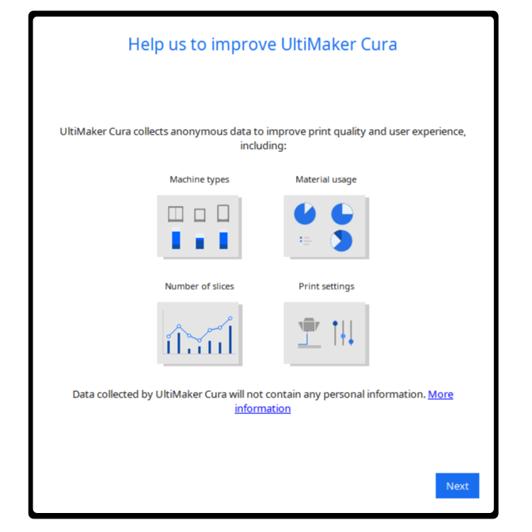  
10) select " Next"   

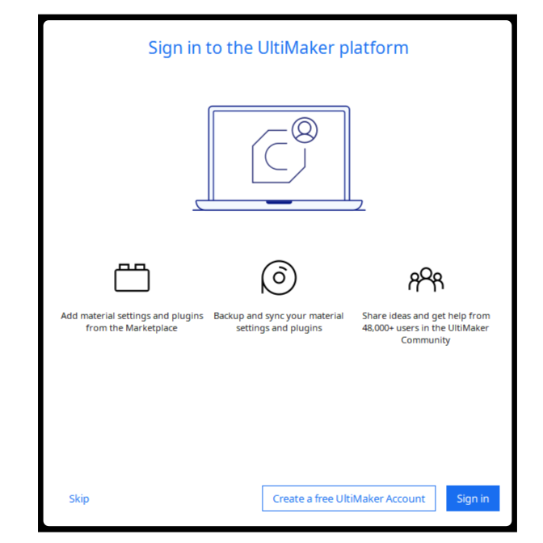  
11) select "skip"   

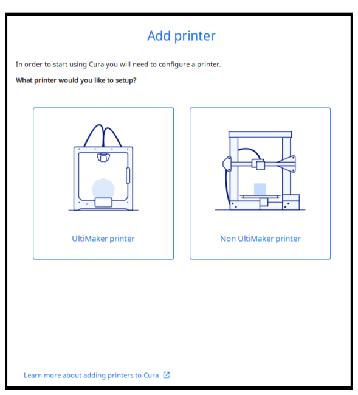  
12) select "Finish" to complete install  

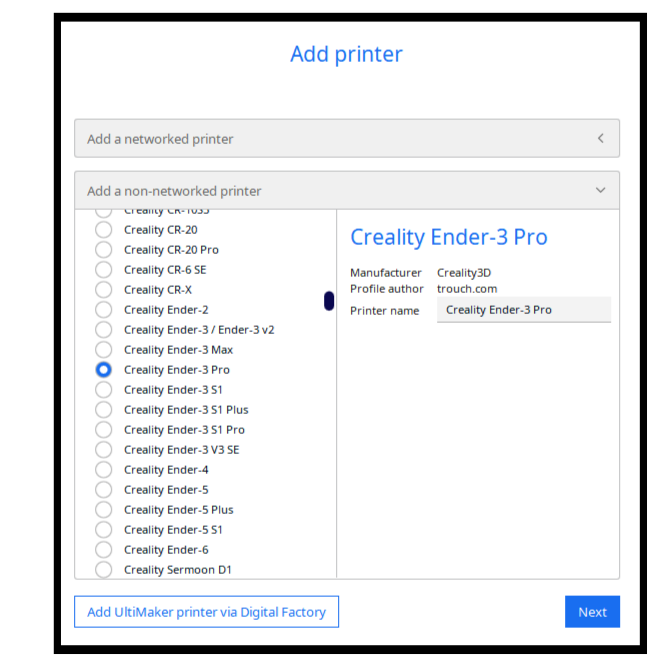  
13) select "Get Started" to begin  

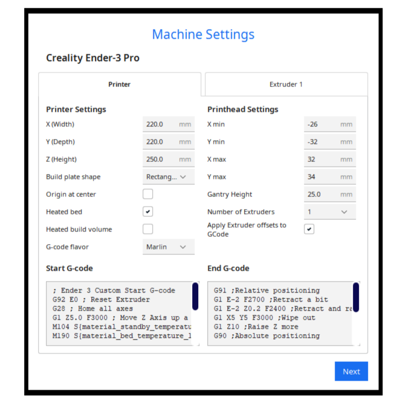  
14) Read agreement and select " I Agree" to install   

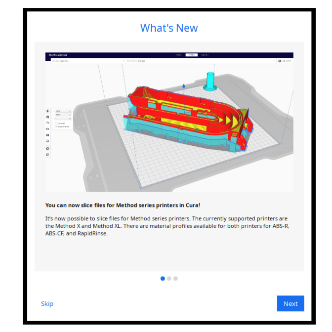  
15) select "Finish" to complete install   

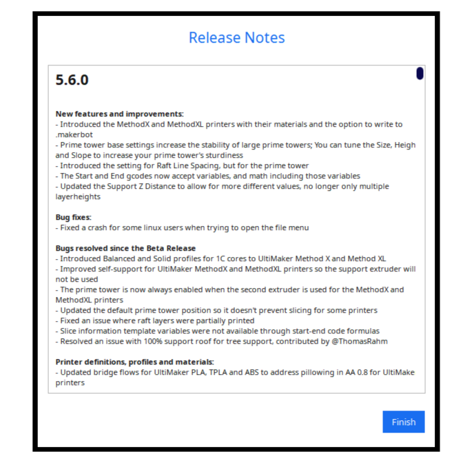  
16) select "Get Started" to begin   

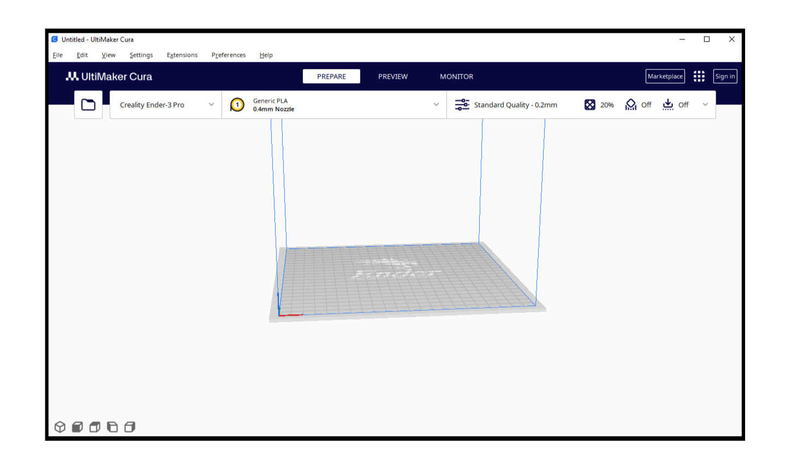  
17) Read agreement and select " I Agree" to install   