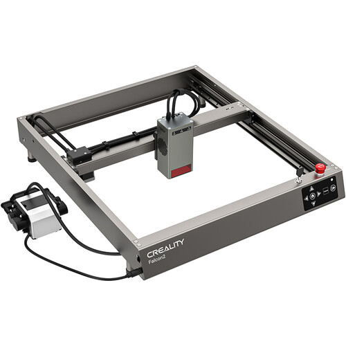

# Fabrication

## Machines
### Creality Ender-3 Pro XL 3D Printer  

 
 

Ender 3 Pro is a Fused Deposition Modelling machine FDM. The system has been customized to allow greater freedom of operation. 

**Upgrades to machine** 

* Increased gantry size : 400mmX, 400mm Y, 500mm Z  
* Duet 2 Wifi controller : Greater Control    
* BL touch sensor: Self Levelling Functionality  
* 1000W heater bed: Allows for Greater Material Choices   

### Anycubic Photon Mono 2
 
{width=60%}  

Anycubic Photon Mono 2 is a vat photopolymerization machine often referred to as SLA printing. 

Machine Specs 

* Build Volume : 165mm X x 89mm Y x 143mm Z  
* LCD Screen : 6.6" Monochrome    
* Light Source : Parallel Matrix  
* XY Axis : 34 Microns   
* Normal Exposure Time: 2.5 Seconds 
* Interface : 2.8" Touch Panel
* Connectivity : USB Type A 2.0

### Creality Falcon-2 40 W Laser Cutter

{width=60%} 
 

#### Hardware

##### Duet Documentation 

[Duet Link](https://docs.duet3d.com/Duet3D_hardware/Duet_2_family/Duet_2_WiFi_Ethernet_Hardware_Overview) 

