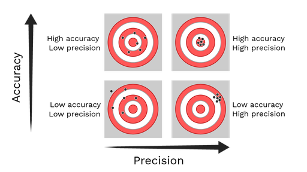
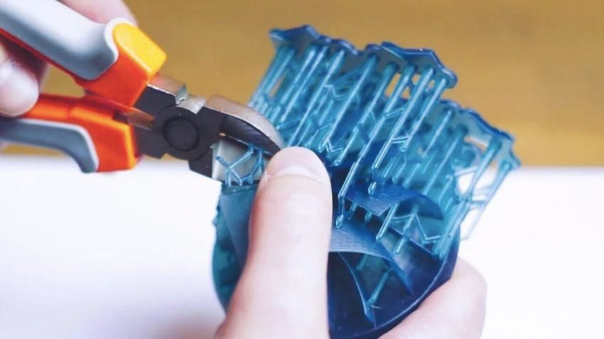

# CHOOSING THE RIGHT TOOL

Would you use a hammer to measure flatness?   or   Maybe a tape measure to hammer a nail?

Although the urge is there to use a wrench as a hammer, this is a sure way to damage your part that you have worked so hard on or the tool that you are using inappropriatly. 

## Clearly formulate your task
* Slow down and think about what you need to accomplish?  
*  How many ways can you accomplish the same task?   
* Given your options, are some options clearly better than the others?   
 What are some things that should be considered?   
 1) Can I hurt myself if I do it? 
 2) Can I hurt someone else? 
 3) ... 
#### Measuring

Precision and accuracy play big roles in the engineering world and understanding how these terms translate into real world situations is important

Precision is how precise you can measure something. Think units of measure (ie.centimeters, micrometers, nanometers) and how repeatable the same measurements can be accomplished.

Accuracy is how close to the true measurement you are.

 

#### Choosing a Datum 

* Where is the best choice for you to choose as a reference point? 
* How do I decide where to measure from?  

There is a lot that goes into how to start measuring. Measurements dont just inform you about the dimensions. Depending on the job, usually you are sending drawings for someone else to interpret your drawings and fabricate the design. Understanding the wide array of fabrication techniques takes years and specialized training, but you need to start somewhere.

**Make sure your tool is zeroed and set to the right units** 
{width=60%}  
The Caliper or Micrometer has the ability to take measurments with 3 points on its body.   

#### Measuring an external dimension 
{width=60%}  

The most common use of a caliper is for measuring the outside body of objects. 

#### Measuring an internal dimension 
{width=60%}  

Calipers can also be used to measure the inside width of object  

#### Measuring a pocket or recess 
{width=60%}  
Calipers can be used to measure depth of cavities (ie. pockets or recesses)   

#### Measuring a curved surface 
{width=60%}  
There are many different ways to make the same measurment.   
**Do you know how to use your math skills to determine the circumference of a circle?  

#### Cleaning the surface of a 3d printed part
Most times it is necessary to remove support structures from 3d printed parts. Carefull design and choice of scaffolding/support structure can reduce the post processing of parts, but with fused deposition modelling FDM printers post cleaning is common.
 

#### Removing Bulk Supports

{width=60%} 
https://robots.net/tech/how-to-remove-supports-3d-printing/

#### Cutting and Grinding

More updates coming soon! 

#### Drivers and Keys

More updates coming soon! 

#### Hammers 

More updates coming soon! 
#### Clamps and Vises

More updates coming soon! 

