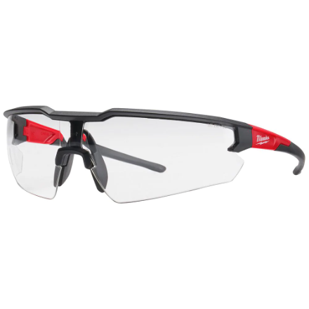
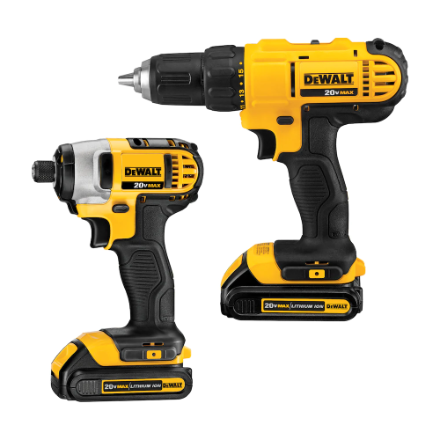

# USING THE TOOLS

There are plenty of tasks out there that require you to be fast and efficient. 
  Sports are a prime example, maybe cleaning your room, but not all tasks are about how fast you can accomplish it.    Take your time when using tools as the name implies the right "tool" should not require you to work hard, if something is not working well, maybe ask "am I using the right tool? and am I using it correctly"  

It also makes a world of difference when working in groups if you know where things are when you need it. Being a good steward of tools and putting things back the way you found them makes everyones life easier.    Tools break, its an unfortunate fact of life and not something to be worried about. If a tool breaks just let the instructor know and it will be replaced.

## Safety always comes first!    Personal Protective Equipment PPE must be used with specific tools and you must always have PPE on when entering the fabrication area 

### Eye Protection
Eye protection is a must when working with all tools  
{ width=30%}

### Gloves
Different jobs require different protection.  Do you have the right gloves for the job?  are you cutting?  drilling?  gluing?  painting? 
{ width=30%}
{ width=30%}

### Drills
Different drills and setting are required for different jobs  Do you need an impact driver?  Are you drilling or screwing? 
{ width=40%} 

### Blades
PPE is always required when using sharp blades. No matter the size of the job! Use safe cutting practices at all times! 
[Safe Cutting Practices](practices/safe-cutting-practices){.md-button } 
{ width=30%}
{ width=15%}
 
### Caliper

{ width=50%}

### Micrometer
 

### Tape Measures
{width=20%} 
{width=20%} 

### Drivers
There are a lot of different types of hardware out in the world. Making sure you have the right type and size driver is important. It is not always about just fastening a part together. Making sure you can take it apart is also important. 
{ width=40%} 

### Hex Keys
Strippng hex keys is common and it can waste valuable time if you need to drill it out. Making sure you have the right system  (ie.Metric or Imperial) and the right size makes all the difference. 
{ width=40%} 

### Taps & Dies
Sometimes you need to make your own internal thread with a tap or an external thread using a die. Cutting oil is mandatory for these tools and patience.
{ width=40%} 

### Hammers
Not all hammers are created equal. Choose the right tool for the job
{ width=40%} 

