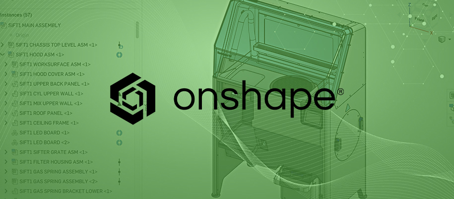

# Software

## Onshape CAD

 
 

Onshape is a professional Computer Aided Design [CAD] Software. The Onshape CAD system allows multiple users to access and work on a single design concurrently over the cloud, using any computer, tablet or phone. Onshape allows teams to collaborate on a single shared design, the same way multiple writers can work together editing a shared document via cloud services.

Course Material Available After Registration

