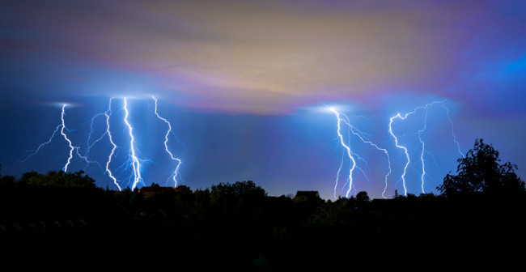

# Electrical Equipment

**Technology is all around us, but do we know how it works?** 

 

Throughout history civilizations have been intrigued by electricity. Th earth can be interpreted as a giant magnet and one only needs to look out in the sky during a lightning storm to understand why people throughout history wanted to know more.  

Deeper Inquiry Link: 
[History and Experiments of Electricity](https://www.britannica.com/topic/The-History-and-Present-State-of-Electricity-with-Original-Experiments){:target="_blank"}

 
Some of the first applications of electricity are related to enhancing communication between people. 

What is a radio and how does it work? 

* How would you build a radio?  
1) Do you know what signals a radio recieves? 
2) Do you know what signals a radio emits? 
3)...
   

* What are the basics you would need to know to analyze if the radio is working properly?  
 
1) Do you know how to measure a volt? 
1) Do you know how to measure resisitance? 
3)...
  

