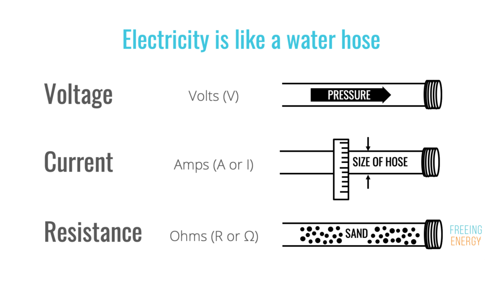
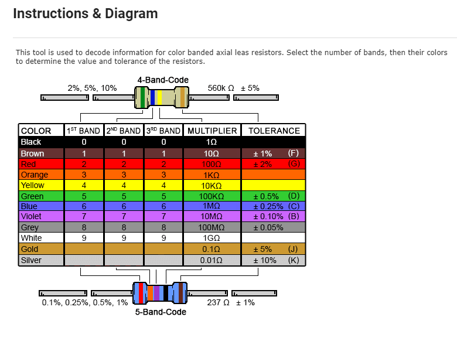

# UNITS OF MEASURE

Students will be introduced to many new terms throughout the camp and get hands on experience navigating micro-controllers, sensors and actuators and begin to understand the basic principles of electricity

{width=80%}  

Additional Research Link: 
[Electricity Analogy](https://www.freeingenergy.com/understanding-the-basics-of-electricity-by-thinking-of-it-as-water/){:target="_blank"}

 

## Resistance

{width=80%} 

Resistor Calculator: 
[Resistor Calculator](https://www.digikey.ca/en/resources/conversion-calculators/conversion-calculator-resistor-color-code){:target="_blank"}
 

## Voltage

## Current

More updates coming soon! 

