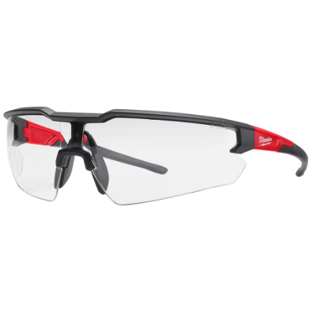

# USING ELECTRONIC EQUIPMENT

There are plenty of tasks out there that require you to be fast and efficient. 
  Sports are a prime example, maybe cleaning your room, but not all tasks are about how fast you can accomplish it.    Take your time when using electrical equipment. 

It also makes a world of difference when working in groups if you know where things are when you need it. Being a good steward of tools and equipment means putting things back the way you found them makes everyones life easier.    Tools and equipment break, its an unfortunate fact of life and not something to be worried about. If a piece of equipment is not working how ypu think it should  just let the instructor know and it will be inspected and/or replaced.

## Safety always comes first!    Personal Protective Equipment PPE must be used with specific tools and you must always have PPE on when entering the fabrication area or working with electronics 

### Eye Protection
Eye protection is a must when working with all electrical equipment  
{ width=30%}

More updates coming soon! 

