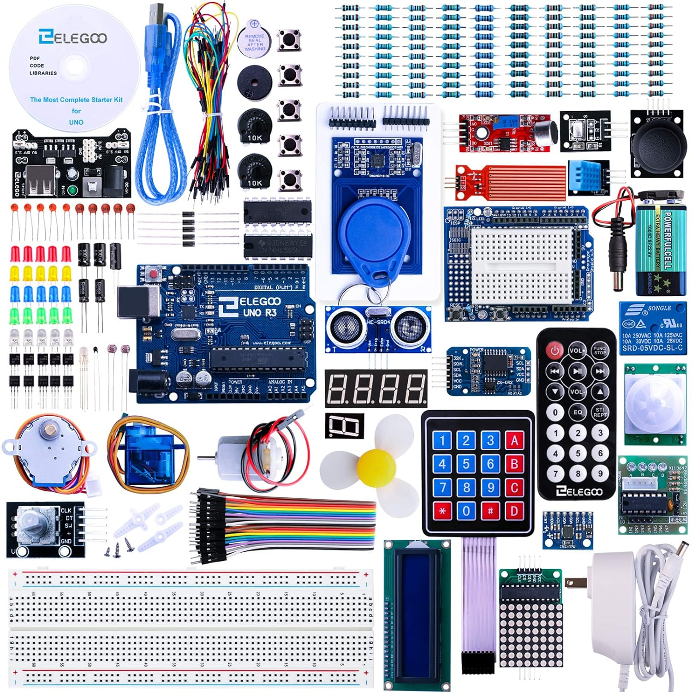

## Partnered Project 
Students will have the opportunity to complete as many lessons as they want during the remaining 5 weeks. In addittion they will learn basic electronic problem solving and get introduced to more advanced electronic testing equipment. If the student wants a challenge and feels they can bring a few lessons together with some additional mechanical skills to reate something of their own they will be encouraged and supported to do so. 
 
{width=200%}  

* Lesson 2 Blink
* Lesson 3 LED
* Lesson 4 RGB LED
* Lesson 5 Digital Inputs
* Lesson 6 Active buzzer
* Lesson 7 Passive Buzzer
* Lesson 8 Tilt Ball Switch
* Lesson 9 Servo
* Lesson 10 Ultrasonic Sensor Module
* Lesson 11 DHT11 Temperature and Humidity Sensor
* Lesson 12 Analog Joystick Module
* Lesson 13 IR Receiver Module
* Lesson 14 LCD Display
* Lesson 15 Thermometer
* Lesson 16 Eight LED with 74HC595
* Lesson 17 The Serial Monitor
* Lesson 18 Photocell 
* Lesson 19 74HC595 And Segment Display 
* Lesson 20 Four Digital Seven Segment Display
* Lesson 21 DC Motors
* Lesson 22 Relay
* Lesson 23 Stepper Motor 
* Lesson 24 Controlling Stepper Motor With Remote 

Additional Research Link:
[ELEGOO](https://www.elegoo.com/en-ca/pages/download){:target="_blank"} 

More updates coming soon! 