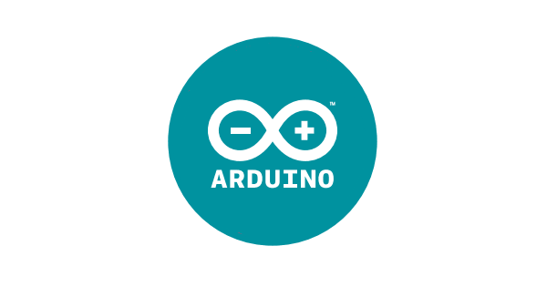

 
 
Arduino Integrated Development Environment (IDE) is an open source IDE that allows users to write code and upload it to any Arduino board. Arduino IDE is written in Java and is compatible with Windows, macOS and Linux operating systems.

More updates coming soon! 
