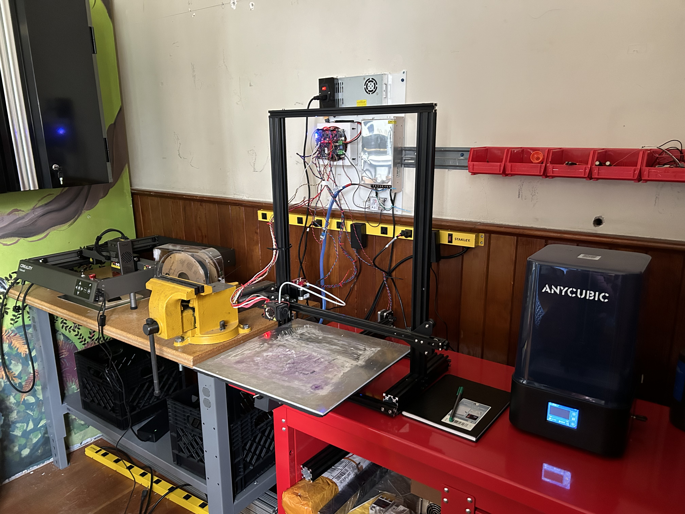

# Welcome

Welcome to the Saplings STEM camps/course materials. Please find below a guide to the main sections of the website. 

We ae happy to introduce our new MakerSpace to the seasons of Saplings and the Pemberton Heights community! 

{width=80%}   

And the newly created Computer Lab! 

{width=80%}   

## Home
The home section (this section) contains various materials related to the camps, nagivating the materials and other administrative information relating to the Saplings STEM objectives and deliverables:

## Engineering Program Overview 

This program is divided into three sequential courses, each designed to introduce students to different
aspects of engineering. With a focus on hands-on learning, critical thinking, and collaboration, students
will progress from basic design and construction in Eng 1 to more complex mechanical systems in Eng 2,
and finally to the fundamentals of electronics in Eng 3. 

General Information for All Courses: 

**Class Size:** Minimum of 6 students, maximum of 8 to ensure personalized instruction and effective teamwork. 

**Duration:** Each course runs for 8 weeks, with 2-hour sessions each week, totaling 16 hours of instruction per course. 

**Tools and Software:** Students will be introduced to ONSHAPE, a professional computer-aided design (CAD) software, different slicer software programs used to get solid models ready for 3D printing, the Arduino Integrated Development Environment IDE for electronics, and a brief introduction to Python. Depending on the course selected  alongside various measurement and fabrication tools relevant to each courses focus. 

---
  

## Eng 1: Design and Build (Ages 8-10) 

**Objective:** Introduce basic engineering concepts through the design and build process, focusing on the use of simple tools, CAD software, and the importance of teamwork. 

**Weeks 1-3: Introduction and Group-Guided Project** 

* **Week 1:** Course introduction, tool and software orientation, and start of the group-guided project (e.g., designing a fidget spinner). 
* **Weeks 2-3:** Continuation of the CAD journey, focusing on translating real-world objects into CAD models, and finalizing the group project for printing. 

[Project Planning Sheet example](eng_1_manual/project-planning-sheet/planning-sheet-example/){.md-button }  

[Project Planning Sheet Download](eng_1_manual/project-planning-sheet/Project_Planning_Sheet_Eng_1.odt){:download="Project_Planning_Sheet_Eng_1.odt"}  

**Weeks 4-8: Self-Guided Project and Course Conclusion** 

* **Week 4:** Introduction to self-guided projects, with students planning and beginning their individual or partnered projects. 

* **Weeks 5-6:** Advanced CAD features and continued project development. 

* **Week 7:** Finalization of projects for fabrication. 

* **Week 8:** Project wrap-up, reflection, and debrief. 

[Eng 1 Manual](eng_1_manual/){.md-button } 

---
  

## Eng 2: Mechanical Systems (Ages 10+) 

**Objective:** Expand upon the foundational skills from Eng 1 with a focus on mechanical systems,introducing concepts of motion, energy, and the use of more complex tools and fabrication methods. 

**Weeks 1-3: Introduction and Partnered Guided Project** 

* **Week 1:** Course introduction with a deeper dive into mechanical tools and software, initiation of the partnered guided project (e.g., building a mechanical catapult). 

* **Weeks 2-3:** Advanced CAD modeling focusing on mechanical components, completion of the guided project. 

[Project Planning Sheet](eng_2_manual/project-planning-sheet/planning-sheet-example/){.md-button }  

[Project Planning Sheet Download](eng_2_manual/project-planning-sheet/Project_Planning_Sheet_Eng_2.odt){:download="Project_Planning_Sheet_Eng_2.odt"}  

**Weeks 4-8: Self-Guided Project and Course Conclusion** 

* **Week 4:** Planning and commencement of self-guided mechanical projects. 

* **Weeks 5-6:** Continued project development with an emphasis on mechanical design principles. 

* **Week 7:** Project finalization for fabrication. 

* **Week 8:** Project completion, reflection, and course debrief. 

[Eng 2 Manual](eng_2_manual/){ .md-button } 

---
  

## Eng 3: Introduction to Electronics (Ages 10+) 

**Objective:** Introduce the basics of electronics, including circuits, sensors, actuators, and the integration of electronic components with mechanical designs. The main focus of this course is electronics and it is expected that the previous mechanical courses have been completed.  

**Weeks 1-3: Introduction and Partnered Guided Project** 

* **Week 1:** Overview of electronic components and tools, beginning of a partnered guided project that incorporates basic electronic circuits (e.g.,servo control). 

* **Weeks 2-3:** Exploration of electronic systems and basic CAD for mounting electronics and completion of the guided electronic project. 

[Project Planning Sheet](eng_3_manual/project-planning-sheet/planning-sheet-example/){.md-button }  

[Project Planning Sheet Download](eng_3_manual/project-planning-sheet/Project_Planning_Sheet_Eng_3.odt){:download="Project_Planning_Sheet_Eng_3.odt"}  

**Weeks 4-8: Self-Guided Project and Course Conclusion** 

* **Week 4:** Introduction to self-guided electronic projects, with an emphasis on creative and practical applications of electronics. 

* **Weeks 5-6:** Advanced electronic design and project execution. 

* **Week 7:** Final preparations for project fabrication. 

* **Week 8:** Final project presentation, course reflection, and debrief. 

[Eng 3 Manual](eng_3_manual/){ .md-button } 

